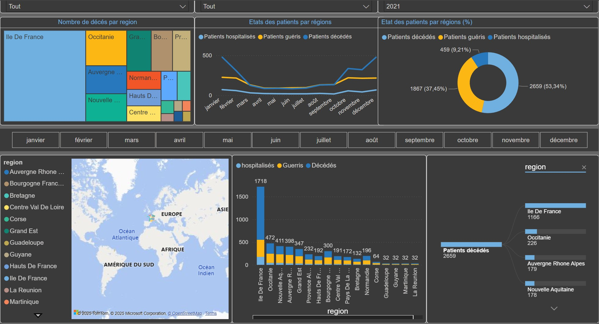

# 🦠 COVID-19 ETL & Reporting Pipeline

# COVID-19 ETL Pipeline & Dashboard Project

## 📌 Project Overview

This personal project was designed to simulate a full end-to-end data processing pipeline based on the COVID-19 theme. It aligns with my goal to strengthen skills in ETL workflows, relational databases, and dashboard creation using modern data tools.

---

## ⚙️ Technologies Used

- **Talend Open Studio** – Data extraction, transformation, and loading (ETL)
- **PostgreSQL** – Data storage and schema modeling (STG, ODS, DWH, DTM)
- **SQL** – Data manipulation, table creation, business rules
- **Power BI** – Final dashboard for interactive data visualization

---

## 🧱 Solution Architecture

The pipeline follows a layered data architecture:

1. **STG (Staging)**: Raw data ingestion
2. **ODS (Operational Data Store)**: Cleansing and business rule enforcement
3. **DWH (Data Warehouse)**: Analytical data modeling
4. **DTM (Datamart)**: Data aggregation for reporting

Each layer is fed by a dedicated Talend job.

---

## 📊 Power BI Dashboard

The Power BI report is included in this repository. It uses final data from the DTM layer to provide insights such as patients by region and type.  

---

## 🎯 Objectives

- Build and automate a full ETL pipeline from ingestion to reporting
- Apply dimensional modeling for an analytical data warehouse
- Visualize actionable insights with Power BI

---

## 🙋‍♂️ Author

**Sedra Claudio R.**  
